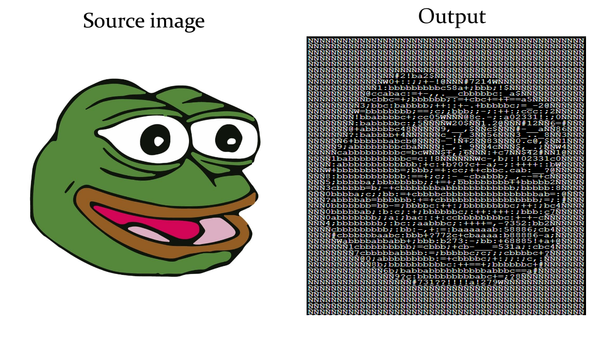

# Image-to-ASCII-using-p5.js

#### This is a simple JavaScript project that creates ASCII art from an image

Every pixel of an image has an RGB and an opacity (alpha) value. We can extract this information for each pixel and redraw the pixels with letters of the alphabet and some special characters.
The pattern 'Ñ@#W$9876543210?!abc;:+=-,._ ' is arranged in such a way they are in the decreasing order of their density (brightness when displayed on screen).
A character from this pattern is chosen to draw the corresponding pixel on the screen.

The code is implemented as follows:
1. Get pixel
2. Choose character from the pattern string according to its average RGB value
3. Print character
 
The final result:

ÑÑÑÑÑÑÑÑÑÑÑÑÑÑÑÑÑÑÑÑÑÑÑÑÑÑÑÑÑÑÑÑÑÑÑÑÑÑÑÑÑÑÑÑÑÑÑÑ
ÑÑÑÑÑÑÑÑÑÑÑÑÑÑÑÑÑÑÑÑÑÑÑÑÑÑÑÑÑÑÑÑÑÑÑÑÑÑÑÑÑÑÑÑÑÑÑÑ
ÑÑÑÑÑÑÑÑÑÑÑÑÑÑÑÑÑÑÑÑÑÑÑÑÑÑÑÑÑÑÑÑÑÑÑÑÑÑÑÑÑÑÑÑÑÑÑÑ
ÑÑÑÑÑÑÑÑÑÑÑÑÑÑÑÑÑÑÑÑÑÑÑÑÑÑÑÑÑÑÑÑÑÑÑÑÑÑÑÑÑÑÑÑÑÑÑÑ
ÑÑÑÑÑÑÑÑÑÑÑÑÑÑÑÑÑÑÑÑÑÑÑÑÑÑÑÑÑÑÑÑÑÑÑÑÑÑÑÑÑÑÑÑÑÑÑÑ
ÑÑÑÑÑÑÑÑÑÑÑÑÑÑÑÑÑÑÑÑÑÑÑÑÑÑÑÑÑÑÑÑÑÑÑÑÑÑÑÑÑÑÑÑÑÑÑÑ
ÑÑÑÑÑÑÑÑÑÑÑÑÑÑÑ#2!ba2$ÑÑÑÑÑÑÑÑÑÑÑÑÑÑÑÑÑÑÑÑÑÑÑÑÑÑ
ÑÑÑÑÑÑÑÑÑÑÑÑÑW0+::;;+-!@ÑÑÑ#7214WÑÑÑÑÑÑÑÑÑÑÑÑÑÑÑ
ÑÑÑÑÑÑÑÑÑÑÑÑ1:bbbbbbbbbc58a+;bbb;!$ÑÑÑÑÑÑÑÑÑÑÑÑÑ
ÑÑÑÑÑÑÑÑÑÑ@ccabac:=+-,,.__cbbbbbc:_a$ÑÑÑÑÑÑÑÑÑÑÑ
ÑÑÑÑÑÑÑÑÑÑbcbbc=+;bbbbbb;:=+cbc+=++==a5ÑÑÑÑÑÑÑÑÑ
ÑÑÑÑÑÑÑÑÑ3;bbc:babbbb;++::+-.+bbbbbc;=_-2@ÑÑÑÑÑÑ
ÑÑÑÑÑÑÑÑW=bbbbbbbb;==;c;;bbb;;-;:++:;ccc:;2ÑÑÑÑÑ
ÑÑÑÑÑÑÑÑ!bbabbbbc+;cc05WÑÑÑ@8c.-;:a02331!:;0ÑÑÑÑ
ÑÑÑÑÑÑÑÑ:babbbbbc:;5ÑÑÑÑW20$ÑÑ1.2@ÑÑÑ#12ÑÑ6=#ÑÑÑ
ÑÑÑÑÑÑÑ@+abbbbbc48ÑÑÑÑÑ9,__,$ÑÑc$ÑÑÑ#-__aÑÑ86ÑÑÑ
ÑÑÑÑÑÑÑ?:babbbb+4ÑÑÑÑÑÑc_.;_3ÑÑ56ÑÑÑ3_.._8ÑÑ3ÑÑÑ
ÑÑÑÑÑÑ6+bbbbbbabcb@ÑÑÑÑ-_!Ñ+2ÑÑ83ÑÑÑ0.c@,$ÑÑ1ÑÑÑ
ÑÑÑÑÑ9;abbbbbbbbcbaÑÑÑÑ:_,:_9ÑÑ4cÑÑÑ$,_.;ÑÑW4ÑÑÑ
ÑÑÑÑÑcabbbbbbbbbc=bcWÑÑ$+,;6ÑÑÑ:+c7ÑÑ$42#ÑÑ1@ÑÑÑ
ÑÑÑÑ1babbbbbbbbbbc=c:!8ÑÑÑÑÑÑWc-,b;:!02331c0ÑÑÑÑ
ÑÑÑÑ:abbbbbbbbbbbbb:+c:+b?0?c+-a;-;:++++::bWÑÑÑÑ
ÑÑÑW+bbbbbbbbbbb=;bbb;=+:cc;++cbbc.cab:__?@ÑÑÑÑÑ
ÑÑÑ8:bbbbbbbbbbbb:==+;c;:-_-cbabbb;_,--=+cÑÑÑÑÑÑ
ÑÑÑ5;bbbbba;bbbbbbbb;;+=+;bbbbbbbbb++bbbbb2ÑÑÑÑÑ
ÑÑÑ3cbbbbb=b;-+cbbbbbbbabbbbbbbbbbbb;bbbbb:8ÑÑÑÑ
ÑÑÑ0bbbba;c;;bb:=+cbbbbcbbbbbbbbbbbbbbbbab=:@ÑÑÑ
ÑÑÑ?abbbbab=bbbbbb:+=+cbbbbbbbbbbbbbbbbb;=;:#ÑÑÑ
ÑÑÑ0bbbbbbb=bb-=;bbbbc:++:;bbbbbbbbc;++:;bc4ÑÑÑÑ
ÑÑÑ0bbbbbab;:b:c;:+;bbbbbbc;:++:+++:;bbb:c7ÑÑÑÑÑ
ÑÑÑ0abbbbbbb;;a:;bac::+:ccbbbbbbbbc:+-+-cÑÑÑÑÑÑÑ
ÑÑÑ4;bbbbbbbb;:bc:;aabbbc;:++++=,-?352:bb2ÑÑÑÑÑÑ
ÑÑÑÑcbbbbbbbbb;:bb:-,+:=:baaaaaab:58886;cb4ÑÑÑÑÑ
ÑÑÑÑ#cbbbbbbaabc:bbb+?772c+cbaaaa:b88886-a;ÑÑÑÑÑ
ÑÑÑÑÑWabbbbabbabb+;bbb:b273:-;bb:+68885!+a+@ÑÑÑÑ
ÑÑÑÑÑÑÑ1cbbbbbbbbb;=cbbb;+cb-___=531a;:cbc4ÑÑÑÑÑ
ÑÑÑÑÑÑÑÑ7cbbbbbabbbb:=;bbbbbc;c;;;cbbbbc+?ÑÑÑÑÑÑ
ÑÑÑÑÑÑÑÑÑ@0;abbbbbbbbb:=+cbbbbc;+:;;:;c,:ÑÑÑÑÑÑÑ
ÑÑÑÑÑÑÑÑÑÑÑ8b;bbbbbbbbbbc:++==+;bbbbbbc+#ÑÑÑÑÑÑÑ
ÑÑÑÑÑÑÑÑÑÑÑÑÑ6b;babbabbbbbbbbbbabbbc==a#ÑÑÑÑÑÑÑÑ
ÑÑÑÑÑÑÑÑÑÑÑÑÑÑÑ9?c:bbbbbbbbbbabc+=;?8ÑÑÑÑÑÑÑÑÑÑÑ
ÑÑÑÑÑÑÑÑÑÑÑÑÑÑÑÑÑÑ#731??!!!!a!279WÑÑÑÑÑÑÑÑÑÑÑÑÑÑ
ÑÑÑÑÑÑÑÑÑÑÑÑÑÑÑÑÑÑÑÑÑÑÑÑÑÑÑÑÑÑÑÑÑÑÑÑÑÑÑÑÑÑÑÑÑÑÑÑ
ÑÑÑÑÑÑÑÑÑÑÑÑÑÑÑÑÑÑÑÑÑÑÑÑÑÑÑÑÑÑÑÑÑÑÑÑÑÑÑÑÑÑÑÑÑÑÑÑ
ÑÑÑÑÑÑÑÑÑÑÑÑÑÑÑÑÑÑÑÑÑÑÑÑÑÑÑÑÑÑÑÑÑÑÑÑÑÑÑÑÑÑÑÑÑÑÑÑ
ÑÑÑÑÑÑÑÑÑÑÑÑÑÑÑÑÑÑÑÑÑÑÑÑÑÑÑÑÑÑÑÑÑÑÑÑÑÑÑÑÑÑÑÑÑÑÑÑ
ÑÑÑÑÑÑÑÑÑÑÑÑÑÑÑÑÑÑÑÑÑÑÑÑÑÑÑÑÑÑÑÑÑÑÑÑÑÑÑÑÑÑÑÑÑÑÑÑ
ÑÑÑÑÑÑÑÑÑÑÑÑÑÑÑÑÑÑÑÑÑÑÑÑÑÑÑÑÑÑÑÑÑÑÑÑÑÑÑÑÑÑÑÑÑÑÑÑ
